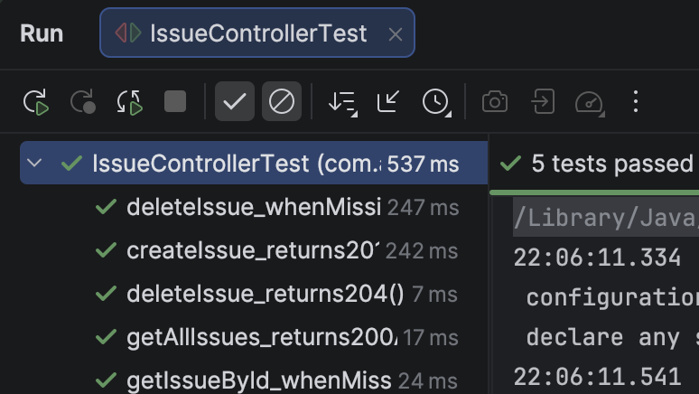
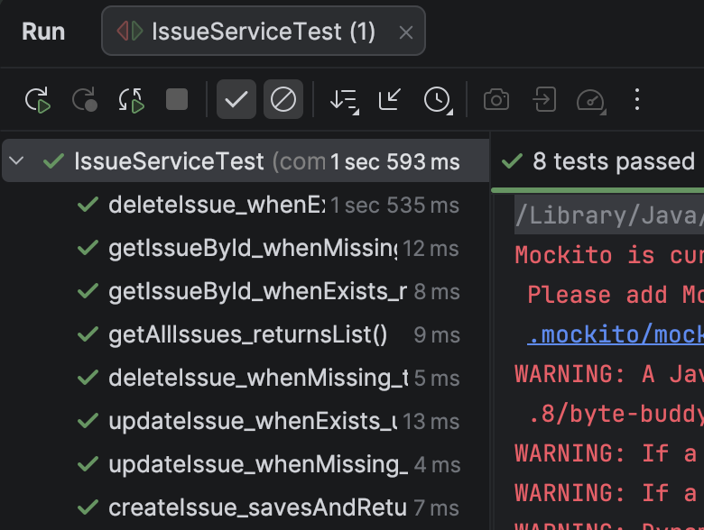
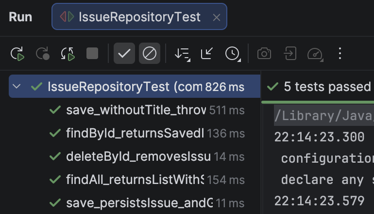
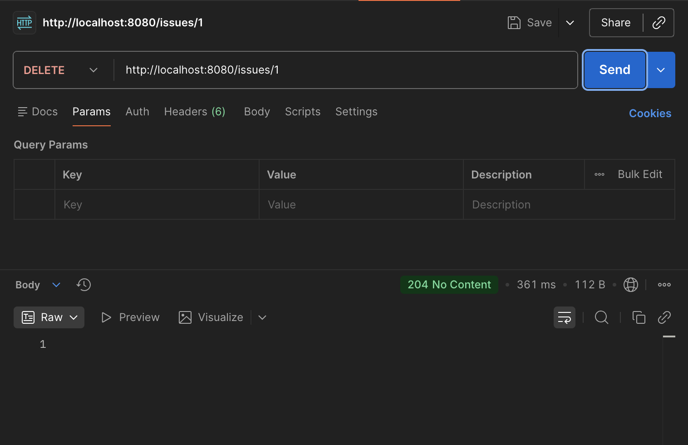
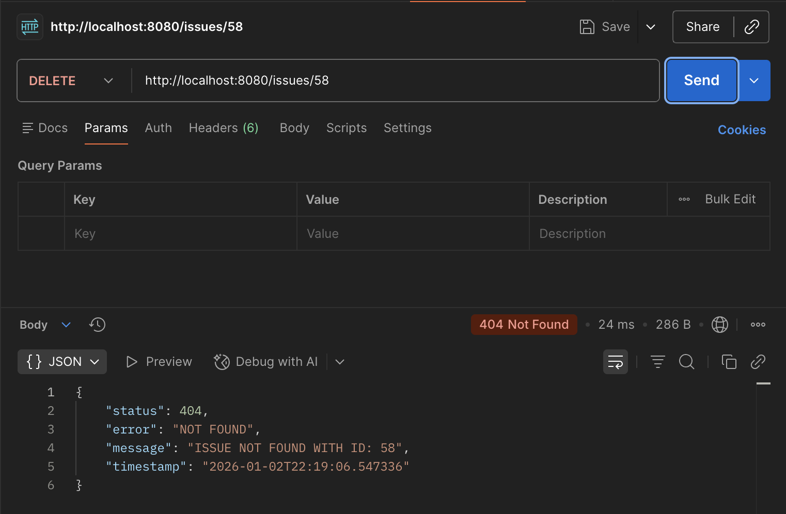

# 🚀 Issue Tracker API — Spring Boot Backend Project

A fully tested RESTful backend application demonstrating clean architecture, exception handling, and professional Spring Boot testing practices.

This project reflects how a modern Java backend service is structured, tested, and maintained in a professional environment.

---

## 🔍 Why This Project Matters

This API was built to showcase:
- Clean **RESTful API design**
- Separation of concerns across **Controller / Service / Repository**
- Defensive programming with **centralized exception handling**
- Confidence in code through **full test coverage**
- Hands-on experience with **Spring Boot + JPA**

It mirrors patterns commonly used in production backend systems.

---

## 🧰 Tech Stack

- **Java 25**
- **Spring Boot 3.5.9**
- **Spring Web**
- **Spring Data JPA**
- **H2 In-Memory Database**
- **JUnit 5**
- **Mockito**
- **MockMvc**
- **Maven**

---

## 🏗 Architecture Overview

Controller → Service → Repository → Database

yaml
Copy code

Each layer is:
- Independently testable
- Clearly scoped
- Designed to prevent tight coupling

---

## 📁 Project Structure

src
├── main
│ ├── java
│ │ └── com.ambrogio.issuetracker
│ │ ├── controller // REST endpoints
│ │ ├── service // Business logic
│ │ ├── repository // Data access (JPA)
│ │ ├── model // Domain entities
│ │ ├── exception // Custom + global errors
│ │ └── IssuetrackerApplication.java
│ └── resources
│ └── application.properties
│
├── test
│ └── java
│ └── com.ambrogio.issuetracker
│ ├── controller // @WebMvcTest
│ ├── service // Mockito unit tests
│ └── repository // @DataJpaTest

yaml
Copy code

---

## 🌐 API Endpoints

| Method | Endpoint            | Description                  |
|------|---------------------|------------------------------|
| GET  | `/issues`           | Retrieve all issues          |
| GET  | `/issues/{id}`      | Retrieve issue by ID         |
| POST | `/issues`           | Create a new issue           |
| DELETE | `/issues/{id}`    | Delete issue by ID           |

---

## ⚠️ Centralized Error Handling

All errors are handled consistently using `@ControllerAdvice`.

Example `404 Not Found` response:

```json
{
  "status": 404,
  "error": "NOT FOUND",
  "message": "ISSUE NOT FOUND WITH ID: 1",
  "timestamp": "2026-01-01T18:28:50.278775"
}
This ensures predictable responses for clients and clean controller code.

🧪 Testing Strategy (Key Highlight)
This project includes three layers of automated testing, mirroring industry best practices.

✅ Controller Tests (@WebMvcTest)
Tests HTTP request/response behavior

Uses MockMvc

Service layer fully mocked

Verifies status codes and JSON payloads

📸


✅ Service Tests (Mockito)
Pure business logic testing

Repository mocked

Covers success and failure scenarios

Ensures correctness independent of database

📸


✅ Repository Tests (@DataJpaTest)
Uses real JPA + H2 database

Validates persistence behavior

Tests save, find, delete operations

📸


🧪 API Validation with Postman
DELETE — Success (204 No Content)
📸


DELETE — Missing Resource (404 Not Found)
📸


▶️ Running the Application Locally
bash
Copy code
git clone https://github.com/YOUR_USERNAME/issuetracker.git
cd issuetracker
./mvnw spring-boot:run
Application:

arduino
Copy code
http://localhost:8080
H2 Console:

bash
Copy code
http://localhost:8080/h2-console
📌 Key Engineering Takeaways
REST APIs designed with correct HTTP semantics

Clean service-oriented architecture

Robust exception handling strategy

High confidence through test isolation

Real database testing (not mocked persistence)

🚧 Potential Enhancements
Swagger / OpenAPI documentation

Pagination & sorting

Authentication & authorization

Dockerized deployment

CI pipeline with GitHub Actions

👤 Author
Ambrogio Bailey
Aspiring Software Engineer focused on Java backend development, Spring Boot, and building production-ready systems with strong testing practices.

GitHub: https://github.com/AmbrogioBailey
LinkedIn: https://www.linkedin.com/in/ambrogio-bailey-b67529373/

